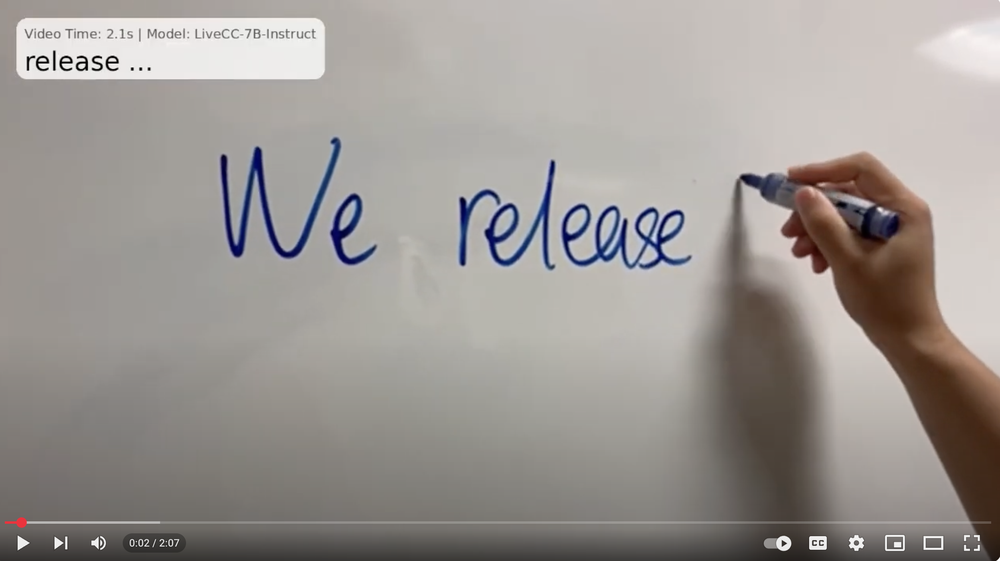

## LiveCC: Learning Video LLM with Streaming Speech Transcription at Scale

<a href="https://showlab.github.io/livecc/" target="_blank"></a>
<a href="https://huggingface.co/spaces/chenjoya/livecc" target="_blank"></a>
<a href="https://arxiv.org/abs/" target="_blank"></a>
<a href="https://huggingface.co/chenjoya/LiveCC-7B-Instruct" target="_blank"></a>
<a href="https://huggingface.co/datasets/chenjoya/Live-WhisperX-526K" target="_blank"></a>
<a href="https://huggingface.co/datasets/stdKonjac/LiveSports-3K" target="_blank"></a>
<a href="https://huggingface.co/collections/chenjoya/livecc-67e29b3df1b6b5c6d5d682f4" target="_blank"></a>

[](https://www.youtube.com/watch?v=56sfodoHXo4)

### TLDR

The first video LLM capable of real-time commentary, trained with a novel video-ASR streaming method, SOTA on both streaming and offline benchmarks.

### Installation

Ensure you have Python version >= 3.11 installed.

```sh
pip3 install torch torchvision torchaudio
pip install transformers accelerate deepspeed peft opencv-python decord datasets tensorboard gradio pillow-heif yt-dlp gdown gpustat timm sentencepiece openai av==12.0.0 python_speech_features scipy wavfile insightface onnxruntime-gpu qwen_vl_utils liger_kernel
pip install flash-attn --no-build-isolation
pip install livecc-utils
```

We finished all things in ```torch==2.6.0```, ```transformers==4.50.0```. But other versions should also work.

### Quick Start

#### Gradio Demo
```
python demo/app.py
```


#### CLI
```
python demo/cli.py
```


#### Hands-on Inference

Please refer to [inference.md](https://github.com/showlab/livecc/blob/main/inference.md)

### Training

Finish on Apr 25.

### Evaluation

#### LiveSports3KCC

The following scripts will automatically download data from [LiveSports3K](https://huggingface.co/datasets/stdKonjac/LiveSports-3K).

##### Real-time Video Commentary (LiveCC)

```bash
# generate livecc
python evaluation/livesports3kcc/distributed_generate_livecc.py --model_path chenjoya/LiveCC-7B-Instruct --output_dir evaluation/livesports3kcc/livecc --num_workers 8
# llm judge winning rate
AZURE_OPENAI_ENDPOINT=xxx AZURE_OPENAI_API_KEY=xxx python evaluation/livesports3kcc/llm_judge.py --model_result_jsonl chenjoya/LiveCC-7B-Instruct --output_dir evaluation/livesports3kcc/livecc --num_workers 8
```

##### Offline Caption (e.g. GPT-4o, Qwen2.5VL, etc)

```
python evaluation/livesports3kcc/distributed_generate_caption.py --model_path Qwen/Qwen2.5-VL-7B-Instruct --output_dir evaluation/livesports3kcc/captions --num_workers 8
```

#### LiveSports3KQA

#### VideoMME

Our fast distributed VideoMME evaluator needs ```videomme.jsonl``` with the data format of each line as:
```json
{"video_id": "001", "duration": "short", "domain": "Knowledge", "sub_category": "Humanity & History", "url": "https://www.youtube.com/watch?v=fFjv93ACGo8", "videoID": "fFjv93ACGo8", "question_id": "001-1", "task_type": "Counting Problem", "question": "When demonstrating the Germany modern Christmas tree is initially decorated with apples, candles and berries, which kind of the decoration has the largest number?", "options": ["A. Apples.", "B. Candles.", "C. Berries.", "D. The three kinds are of the same number."], "answer": "C", "tos_key": "evaluation/testsets/video_undestanding/videomme/videos/fFjv93ACGo8.mp4", "subtitles": "[Music] and new at 6:00 ..."}
```

After preparation, please run:
```shell
# without subtitles
torchrun --standalone --nproc_per_node=8 evaluation/videomme/distributed_evaluate_videomme.py --model_path chenjoya/LiveCC-7B-Instruct --benchmark_path videomme.jsonl
# with subtitles
torchrun --standalone --nproc_per_node=8 evaluation/videomme/distributed_evaluate_videomme.py --model_path chenjoya/LiveCC-7B-Instruct --benchmark_path videomme.jsonl --with_subtitles
```
Typically, it costs ~40min (no subtitles) or ~50min (with subtitles) to finish the evaluation (8x80G GPUs). The results will be written to [evaluation/videomme/results](evaluation/videomme/results). We also provided the evaluation results of [LiveCC-7B-Instruct](https://huggingface.co/chenjoya/LiveCC-7B-Instruct) at [evaluation/videomme/results](evaluation/videomme/results).

#### OVOBench

Finish on Apr 26.

#### MVBench

Finish on Apr 26.

### Data Production Pipeline

Finish on Apr 27.

#### Pre-training

#### SFT

### Citation

```
@inproceedings{livecc,
    author       = {Joya Chen and Ziyun Zeng and Yiqi Lin and Wei Li and Zejun Ma and Mike Zheng Shou},
    title        = {LiveCC: Learning Video LLM with Streaming Speech Transcription at Scale},
    booktitle    = {CVPR},
    year         = {2025},
}
```
